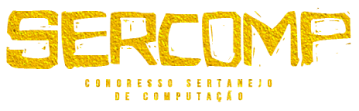
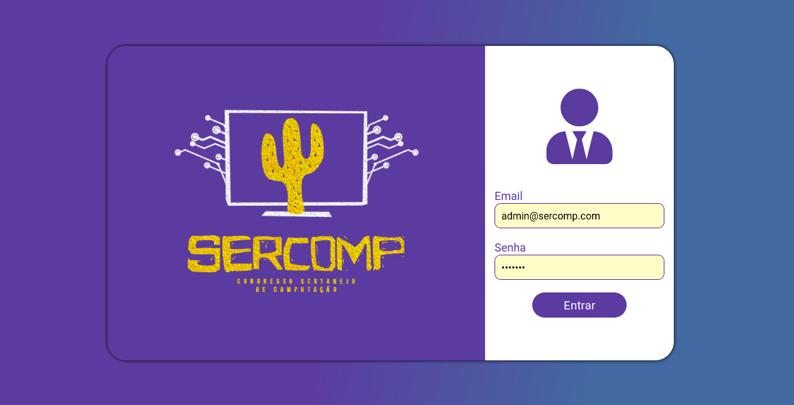
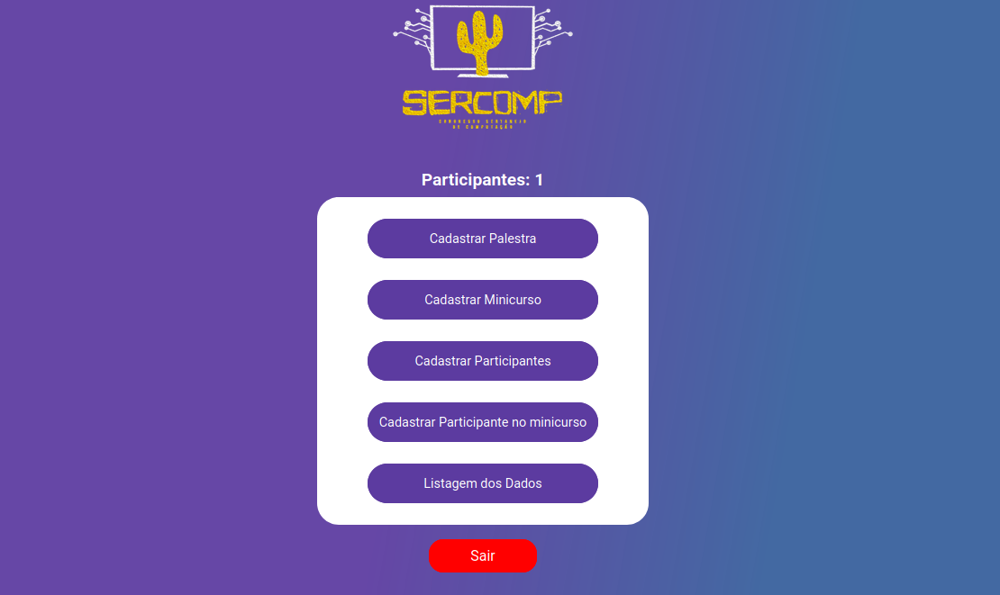
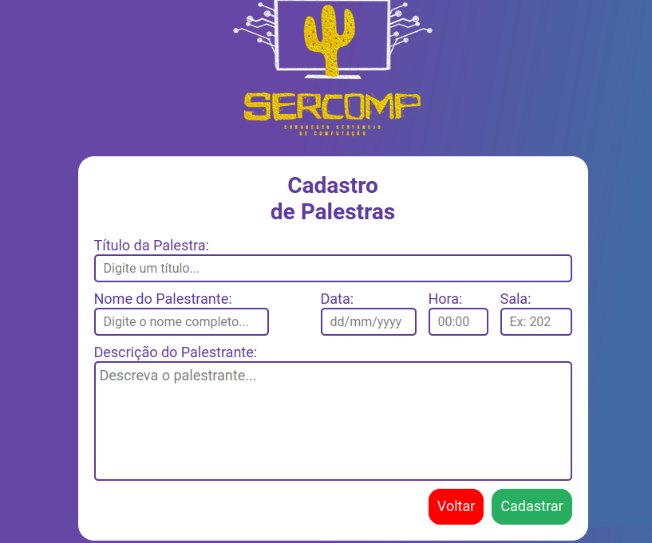
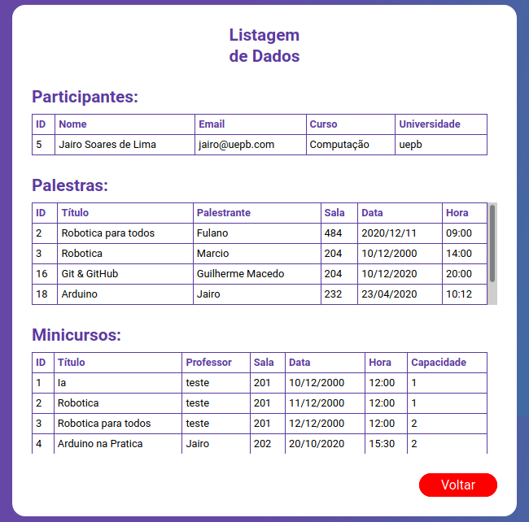

<h1 align="center">
  
Sercomp Project

  
</h1>

  <a href="#-projeto">Project</a>&nbsp;&nbsp;&nbsp;|&nbsp;&nbsp;&nbsp;
  <a href="#rocket-tecnologias">Technology</a>&nbsp;&nbsp;&nbsp;|&nbsp;&nbsp;&nbsp;
  <a href="#eye-Screens">Screens</a>&nbsp;&nbsp;&nbsp;|&nbsp;&nbsp;&nbsp;
  <a href="#closed_book-Commands">Commands</a>&nbsp;&nbsp;&nbsp;|&nbsp;&nbsp;&nbsp;
  <a href="#-layout">Layout</a>&nbsp;&nbsp;&nbsp;|&nbsp;&nbsp;&nbsp;
  <a href="#memo-licença">License</a>

 

## 💻 Projeto

   - The Sercomp project aims to improve the search for event informations through the WEB aplication for the Admins and Mobile to the users.

  - The admin will be able to register all participants and Sercomp events

  - The mobile users will be able to see all your joined events, like speeches, mini courses and more.

## :rocket: Tecnologias
- [Figma](https://www.figma.com/)
- [Node.js](https://nodejs.org/en/)
- [React](https://reactjs.org)
- [React Native](https://facebook.github.io/react-native/)
- [React-toastify](https://fkhadra.github.io/react-toastify/introduction/)

## 🔖 Layout

**See some screens just below ⬇️**

   

  
  
  
  
  
  

 

## :eye: Screens
  * Sing In
  * DashBoard
  * Create Lecture
  * Create Mini Course
  * Register Participants in a Mini Course
  * List of all data
  
   

## :closed_book: Commands

 

## :memo: Licença

Esse projeto está sob a licença MIT. Veja o arquivo [LICENSE](LICENSE.md) para mais detalhes.